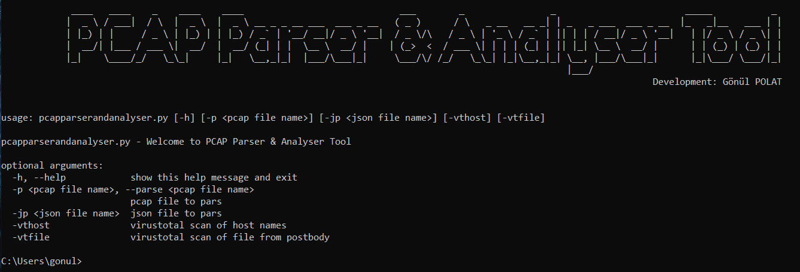

# Pcap-Parser-Analyser

-Read a PCAP file.

-Parse the HTTP requests and HTTP response.

-Extract HTTP requests,response and dump those into a JSON file.

-Parse the json file, Extract HTTP body and transferred file.

-Virustotal scan.

## Usage

pcapparserandanalyser -h 

